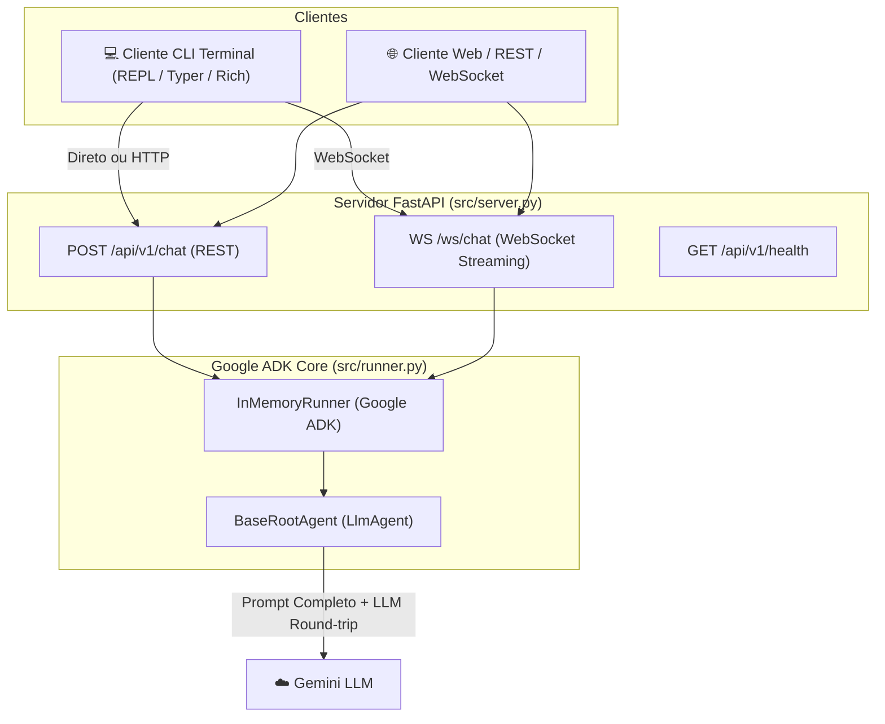

# Cenário Base: Web Server (FastAPI), Cliente CLI & Agente Monolítico (Google ADK)

Configuração da infraestrutura base da aplicação unindo um servidor web **FastAPI**, interface **CLI no Terminal** e o runner do **Google Agent Development Kit (Google ADK)** instanciando um agente monolítico sem roteamento ou cache.

---

## 🎯 Arquitetura da Solução

Nesta fase, a aplicação disponibiliza duas interfaces de atendimento (REST API e WebSocket via FastAPI, além de um cliente REPL via Terminal CLI) que comunicam diretamente com o runner do Google ADK.



---

## 🛠️ Recursos Implementados

1. **Servidor Web FastAPI ([`src/server.py`](file:///main/2_personal/cases/multi-agent-ai-routing-caching-context-protection/src/server.py))**:
   - `POST /api/v1/chat`: Endpoint REST para envio de mensagens com suporte a sessão e métricas completas de resposta.
   - `WS /ws/chat`: Endpoint WebSocket para conversação com streaming de respostas em tempo real (`start`, `delta`, `complete`).
   - `GET /api/v1/health`: Verificação de status do servidor e agente.

2. **Cliente Terminal CLI REPL ([`cli.py`](file:///main/2_personal/cases/multi-agent-ai-routing-caching-context-protection/cli.py))**:
   - Interface interativa contínua via Terminal usando **Typer** e **Rich**.
   - Suporte a execução em modo local (direto no ADK Runner) ou modo servidor (via HTTP/REST no FastAPI).
   - Painel dinâmico exibindo respostas e métricas (Latência ms, Prompt Tokens, Completion Tokens, Total Tokens e Alertas de Arquitetura).

3. **Google ADK Runner Integrado ([`src/runner.py`](file:///main/2_personal/cases/multi-agent-ai-routing-caching-context-protection/src/runner.py))**:
   - Gerenciamento de sessões de usuário (`InMemorySessionService`).
   - Streaming assíncrono de eventos e medição precisa do consumo de tokens.

---

## 🚀 Como Executar

### 1. Iniciar o Servidor FastAPI

```bash
# Via CLI
python cli.py server

# Ou diretamente via uvicorn
uvicorn src.server:app --reload --port 8000
```

O servidor estará acessível em `http://127.0.0.1:8000`. A documentação Swagger interativa pode ser aberta em `http://127.0.0.1:8000/docs`.

### 2. Iniciar a Interface CLI REPL no Terminal

```bash
# Modo Local (Conecta direto ao Runner do ADK)
python cli.py

# Modo Servidor (Conecta à API FastAPI rodando na porta 8000)
python cli.py --url http://127.0.0.1:8000
```

### 3. Enviar Consulta Única via CLI

```bash
python cli.py ask "Bom dia"
```

### 4. Executar os Testes Automatizados (Pytest)

```bash
pytest
```

---

## 📊 Endpoints da API REST e WebSocket

### REST: `POST /api/v1/chat`
**Payload de Requisição:**
```json
{
  "message": "Bom dia",
  "user_id": "usr_123",
  "session_id": null
}
```

**Resposta:**
```json
{
  "response": "Olá! Bom dia! Como posso ajudar você hoje?",
  "session_id": "a9c1e284-482d-4560-a2ef-64b54e7d4d3a",
  "user_id": "usr_123",
  "metrics": {
    "latency_ms": 665.2,
    "prompt_tokens": 385,
    "completion_tokens": 35,
    "total_tokens": 420,
    "is_mock": true,
    "problem_tags": [
      "ALTO_CONSUMO_TOKENS_SAUDACAO (Prompt Bloqueado enviado inteiro)",
      "LATENCIA_ROUNDTRIP_LLM (665.2ms)",
      "SEM_ESPECIALIZACAO_CONTEXTO (Agente genérico processou sem roteador)"
    ]
  }
}
```

---

## ❌ Problema Evidenciado neste Cenário

> [!WARNING]
> **Round-trip Completo e Desnecessário na LLM**: Qualquer mensagem enviada via CLI ou FastAPI (REST ou WebSocket) — até mesmo uma saudação trivial como *"Olá"* ou *"Bom dia"* — faz um ciclo completo de rede até a LLM via Google ADK.
> 
> Isso gera **alta latência (~660ms a 1200ms)** e **alto consumo de tokens de prompt (385+ tokens por mensagem)** por falta de um roteador de intenções ou camada de cache estático/semântico antecedendo o agente monolítico.
